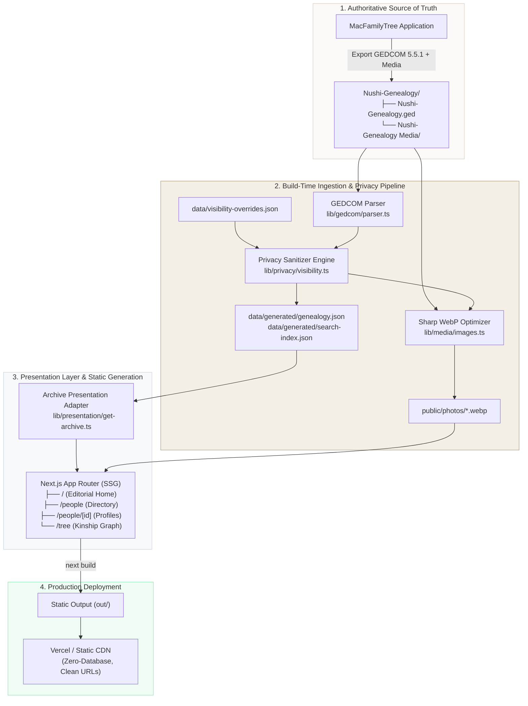
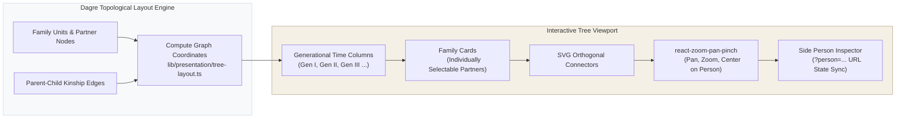

# Nushi Family Genealogy Archive

<div align="center">

[](https://github.com/mal-nushi-dev/fisi/actions/workflows/mega-linter.yml)
[](https://nextjs.org/)
[](https://react.dev/)
[](https://www.typescriptlang.org/)
[](https://tailwindcss.com/)
[-6E9F18.svg?style=flat&logo=vitest)](https://vitest.dev/)
[](#data-ingestion--privacy-management-sop)
[](#privacy-ethics--confidentiality-notice)

**An archival ledger, pedigree registry, and interactive kinship graph for the Nushi family.**

[Architecture](#system-architecture) • [Features](#key-features--page-tour) • [Data Pipeline & SOP](#data-ingestion--privacy-management-sop) • [Local Development](#getting-started--local-development) • [Quality Gates](#quality-engineering--cicd-gates) • [Deployment](#deployment--hosting)

</div>

---

## Executive Summary & Core Principles

The **Nushi Family Genealogy Archive** is a dedicated digital archive and genealogy explorer. It pairs editorial typography and high-density kinship visualizations with a strict **privacy-first, static-export architecture**.

Genealogical records are curated in [MacFamilyTree](https://www.syniumsoftware.com/macfamilytree) as the authoritative editing source. Rather than maintaining a stateful database or public editing endpoints, this application ingests raw GEDCOM files and media, executes strict build-time privacy sanitization and media optimization, and exports a pure static Next.js application.

### Foundational Principles

1. **MacFamilyTree as Single Source of Truth**: All individual updates, family links, and historical citations originate in MacFamilyTree. The web application is strictly read-only.
2. **Zero Runtime Database & Zero API Leaks**: The entire site is compiled into static HTML/JSON artifacts (`output: "export"`). There are no server databases, runtime APIs, or client mutations.
3. **Build-Time Privacy Enforcement**: Sensitive vitals (birth dates, birth places, map coordinates, private photos) belonging to living family members are **physically omitted** during data compilation. No redacted information ever reaches the client bundle or public export.
4. **Editorial Archival Aesthetic**: The interface follows a timeless, Swiss-inspired design system driven by serif headlines (*Cormorant Garamond*), crisp metadata (*Plus Jakarta Sans*), tactile borders, and warm neutral surfaces.
5. **Deterministic Graph Layout**: Pedigree charts and kinship graphs are laid out deterministically using a customized [Dagre](https://github.com/dagrejs/dagre) topological sort mapped to generational time columns, supporting deep zoom, pan, and branch filtering.

---

## System Architecture

The application enforces a strict presentation boundary between raw genealogical inputs, build-time generated models, and static React components.



### Presentation Boundary & Adaptations

- **Isolated Raw Inputs**: Raw GEDCOM data, unredacted names, and source images are never imported into client components or copied directly to the `public/` directory.
- **Pure Adapters (`lib/presentation/archive.ts`)**: Server components call `getArchivePresentation()` to derive display branches, time spans, generation depths, and relative references. These are navigation groupings, not historical era or biological assertions.
- **Root Ancestor Resolution**: The primary archival root is deterministically calculated as the ancestor with the most unique descendants, followed by greatest lineage depth, and lowest natural record ID.
- **Client Hydration Boundary**: Interactive search controls and tree viewports run as Client Components wrapped in `<Suspense>` boundaries to preserve static site generation across URL parameters.

---

## Key Features & Page Tour

| Route | Primary UX Purpose | Architecture & Tech Stack |
| :--- | :--- | :--- |
| **`/`**<br>*(Archive Home)* | Editorial overview, key metrics (earliest ancestor, total records, generations), and instant archive search. | Server-rendered static shell; interactive `HomeSearch` client component with session history. |
| **`/people`**<br>*(Directory)* | Full surname-ordered roster with multi-faceted filtering by branch, generation, status, and initial. | Static directory supporting deep-linked URL filter state (`?branch=...&gen=...&status=...`). |
| **`/people/[id]`**<br>*(Person Profile)* | Archival ledger page displaying recorded vitals, kinship connections (parents, partners, children, siblings), and ancestors. | Statically pre-rendered for every individual via `generateStaticParams`; graceful redaction fallback for living individuals. |
| **`/tree`**<br>*(Interactive Graph)* | Comprehensive generational kinship graph with pan/zoom navigation, branch isolation, and person inspection. | [Dagre](https://github.com/dagrejs/dagre) topological layout mapped to horizontal generation columns; viewport managed via `react-zoom-pan-pinch`. |

### Kinship Tree Visualization Architecture



- **Family Unit Clustering**: Families are rendered as cohesive units containing individually selectable partners. Individuals appearing in multiple unions maintain their unified identity without duplicating records.
- **Generation Alignment**: Horizontal placement is anchored to strict generation depth rather than approximate birth dates, avoiding visual collision when historical dates are uncertain.
- **Deep-Linking**: Direct links to specific individuals (`/tree?person=I15`) or lineages (`/tree?branch=I1`) automatically position the viewport and open the detailed inspector.

---

## Data Ingestion & Privacy Management (SOP)

This Standard Operating Procedure (SOP) describes how to export updated genealogy data from MacFamilyTree, audit privacy policies, and rebuild the static dataset.

### Pipeline Workflow Overview

```
MacFamilyTree Export ➔ File Placement ➔ Privacy Audit (CLI) ➔ Build Data & WebP Optimization ➔ Next.js Static Build
```

### Step 1: Export from MacFamilyTree

1. Open the family database in **MacFamilyTree**.
2. Navigate to **File ➔ Export ➔ GEDCOM...**.
3. Choose the following settings:
   - **Format**: GEDCOM 5.5.1
   - **Character Set**: UTF-8
   - **Media Files**: Export media files to an accompanying folder (e.g., `Nushi-Genealogy Media/`).
   - **Notes and Events**: Include all events and family relationships.
4. Complete the export to your local workstation.

### Step 2: Place Source Assets in Repository

Move the exported files to the repository root:

```bash
# Verify the structure in the workspace root
Nushi-Genealogy/
├── Nushi-Genealogy.ged
└── Nushi-Genealogy Media/
    ├── 1728220.png
    ├── 27540102.png
    └── ...
```

> [!IMPORTANT]
> The GEDCOM parser in `lib/gedcom/parser.ts` handles CR-only (`\r`), LF (`\n`), and CRLF (`\r\n`) line endings automatically. Do not manually convert line endings in the `.ged` file.

### Step 3: Configure Privacy Overrides

The privacy engine defaults to:
- **Deceased Individuals** (`isDeceased: true`): Sensitive fields default to `visible`.
- **Living Individuals** (`isDeceased: false`): Sensitive fields (`birthDate`, `birthPlace`, `deathDate`, `deathPlace`, `photo`, `mapCoordinates`) default to `hidden`.

To customize visibility or exclude records entirely, edit [`data/visibility-overrides.json`](file:///Users/malnushi/Git/fisi/data/visibility-overrides.json):

```json
{
  "version": 1,
  "defaultPolicy": {
    "sensitiveFields": [
      "birthDate",
      "birthPlace",
      "deathDate",
      "deathPlace",
      "photo",
      "mapCoordinates"
    ]
  },
  "overrides": {
    "I61": {
      "fields": {
        "photo": "visible"
      }
    },
    "I999": {
      "exclude": true
    }
  }
}
```

- **`exclude: true`**: Completely removes the individual and associated edges from all outputs, search indexes, and tree visualizations.
- **`fields.<field>: "visible" | "hidden"`**: Explicitly overrides the default visibility for a single sensitive attribute.

### Step 4: Run the Pre-Flight Privacy Audit

Audit the resolved privacy states across the entire dataset before generating output:

```bash
npm run privacy:report
```

This outputs a terminal audit table detailing every individual:

```text
========================================================================================
                                PRIVACY RESOLUTION REPORT
========================================================================================
ID      | DECEASED | BIRTH  | PHOTO | NAME                           | STATUS
----------------------------------------------------------------------------------------
I1      | YES      | 1880   | Yes   | Qamil Nushi                    | Visible (Deceased)
I15     | NO       | 2002   | No    | Olti Nushi                     | Redacted (Living)
I61     | NO       | ????   | Yes   | Amanda Williams                | Redacted (Living)
----------------------------------------------------------------------------------------
Total: 128 | Deceased: 13 | Living (Redacted): 115 | Overridden: 1 | Excluded: 0
```

### Step 5: Execute Ingestion & Media Optimization

Execute the compilation script:

```bash
npm run build-data
```

The script executes the following steps:
1. Parses `Nushi-Genealogy/Nushi-Genealogy.ged`.
2. Applies privacy sanitization via `lib/privacy/visibility.ts`.
3. Optimizes and resizes authorized photos into modern WebP format (`public/photos/*.webp`) via [Sharp](https://sharp.pixelplumbing.com/).
4. Prunes stale public images that are no longer referenced or authorized.
5. Emits sanitized JSON payloads:
   - `data/generated/genealogy.json`: Normalized persons, families, places, and relationships.
   - `data/generated/search-index.json`: Minified index for instant client search.

> [!NOTE]
> `npm run build` runs `prebuild`, which automatically invokes `npm run build-data` before every production static export.

---

## Getting Started & Local Development

### Prerequisites

- **Node.js**: `v22.x` (LTS) or higher
- **npm**: `v10.x` or higher

### Installation

Clone the repository and install dependencies:

```bash
git clone git@github.com:mal-nushi-dev/fisi.git
cd fisi
npm ci
```

### Development Server

Start the local Next.js development server:

```bash
npm run dev
```

Open [http://localhost:3000](http://localhost:3000) in your browser. Fast Refresh will update changes in real time.

### Available Scripts

| Command | Action |
| :--- | :--- |
| `npm run dev` | Starts Next.js development server on port `3000`. |
| `npm run build-data` | Runs the GEDCOM ingestion, privacy redaction, and WebP image pipeline. |
| `npm run privacy:report`| Generates a terminal table of resolved visibility for all individuals. |
| `npm run build` | Ingests data (`prebuild`) and builds the static export into `out/`. |
| `npm run start` | Serves the production build locally (requires `next start` on non-exported builds, or any static file server on `out/`). |
| `npm test` | Runs the full Vitest unit test suite (60 tests). |
| `npm run test:watch` | Runs Vitest in interactive watch mode. |
| `npm run lint` | Runs ESLint with Next.js rules and complexity/maintainability thresholds. |
| `npm run duplication` | Runs `jscpd` token-based copy-paste duplication analysis across `app`, `components`, and `lib`. |

---

## Quality Engineering & CI/CD Gates

The codebase enforces strict maintainability and code hygiene standards through multi-tiered quality gates:

### 1. Architectural & Complexity Guardrails (ESLint)

In [`eslint.config.mjs`](file:///Users/malnushi/Git/fisi/eslint.config.mjs), code is subject to cognitive and structural complexity budgets:

- **Cyclomatic Complexity**: Max `15` per function
- **Function Length**: Max `75` lines (excluding comments and whitespace)
- **Max Block Depth**: Max `4` nested blocks
- **Function Parameters**: Max `4` arguments
- **Nested Callbacks**: Max `3` callbacks

Run checks locally:

```bash
npm run lint
```

### 2. Copy-Paste Duplication Analysis (`jscpd`)

Token duplication is monitored across `app/`, `components/`, and `lib/` using [`jscpd`](https://github.com/kucherenko/jscpd):

```bash
npm run duplication
```

### 3. Automated Unit Testing (Vitest)

Unit tests in `test/` cover parsing, privacy rules, data accessors, and graph rendering logic:

```bash
npm test
```

Test coverage includes:
- **`test/gedcom/parser.test.ts`**: GEDCOM line-ending normalization, entity parsing, event extraction, cross-referencing.
- **`test/privacy/visibility.test.ts`**: Deceased/living resolution, override precedence, field-level redaction, exclusions.
- **`test/data/genealogy.test.ts`**: Typed data accessors, relationship lookups, partner and child retrieval.
- **`test/presentation/archive.test.ts`**: Root ancestor selection, generational branch formation, era and date derivation.
- **`test/presentation/tree-layout.test.ts`**: Dagre layout coordination, coordinate calculation, multi-family unit positioning.
- **`test/presentation/search.test.ts`**: Fuzzy search filtering, tokenization, and query matching.

### 4. Continuous Integration (MegaLinter)

Every pull request and push to `main` triggers the [MegaLinter Quality Check workflow](file:///Users/malnushi/Git/fisi/.github/workflows/mega-linter.yml).

The automated gate executes:
- **`REPOSITORY_JSCPD`**: Verifies 0% duplicate code tokens.
- **`REPOSITORY_BETTERLEAKS`**: Secret scanning via Gitleaks to prevent credential leakage.
- **`TYPESCRIPT_ES` & `JAVASCRIPT_ES`**: Runs repo-configured ESLint rules.
- **`MARKDOWN_MARKDOWNLINT`**: Enforces documentation formatting and heading structure.
- **`JSON_JSONLINT` & `YAML_YAMLLINT`**: Validates configuration syntax.

---

## Deployment & Hosting

### Target Architecture: Vercel Static Hosting

The project is pre-configured for deployment to [Vercel](https://vercel.com/) with native support for `@vercel/speed-insights`.

Because `next.config.ts` specifies `output: "export"`, the build output is fully static HTML, CSS, JavaScript, and WebP images located in the `out/` directory.

#### Vercel Configuration Settings

- **Framework Preset**: Next.js
- **Build Command**: `npm run build` *(runs `prebuild` ➔ `build-data` ➔ `next build`)*
- **Output Directory**: `out`
- **Node.js Version**: `22.x`

### Deploying to Generic Static Hosts (Cloudflare Pages, Nginx, Caddy, S3/CloudFront)

When hosting on other static platforms, ensure the following requirements are met:

1. **Clean URLs / Extensionless Routing**: The static host must resolve `/tree` to `/tree.html` and `/people` to `/people.html` without requiring explicit `.html` extensions in URLs.
2. **Private Input Exclusion**: Verify that the source files (`Nushi-Genealogy/`, `data/visibility-overrides.json`, `.git/`) are never served publicly. Only the contents of the `out/` folder should be mounted to the public document root.
3. **Cache Headers**:
   - `out/_next/static/*`: Immutable caching (`Cache-Control: public, max-age=31536000, immutable`).
   - `out/photos/*`: Long-term caching with revalidation.
   - HTML pages: Short or no-cache revalidation (`Cache-Control: public, max-age=0, must-revalidate`).

---

## Repository Directory Layout

```text
fisi/
├── .github/
│   └── workflows/
│       └── mega-linter.yml        # MegaLinter CI workflow definition
├── app/                           # Next.js App Router static pages
│   ├── globals.css                # Global styles and Tailwind v4 imports
│   ├── layout.tsx                 # Root layout, fonts (Cormorant & Jakarta), SpeedInsights
│   ├── not-found.tsx              # Archival 404 page
│   ├── page.tsx                   # Editorial Home route (/)
│   ├── people/
│   │   ├── page.tsx               # People directory route (/people)
│   │   └── [id]/page.tsx          # Individual profile route (/people/[id])
│   └── tree/
│       └── page.tsx               # Kinship graph route (/tree)
├── components/                    # Modular React components
│   ├── layout/                    # SiteHeader, SiteFooter, Navigation
│   ├── people/                    # PeopleDirectory, PersonCard, ProfileView
│   ├── search/                    # HomeSearch, SearchModal, Autocomplete
│   ├── tree/                      # TreeExplorer, FamilyCard, PersonInspector
│   └── ui/                        # Button, Input, Modal, Badge primitives
├── data/
│   ├── generated/                 # Pre-sanitized JSON artifacts (built by build-data.ts)
│   │   ├── genealogy.json         # Sanitized entities and kinship graph
│   │   └── search-index.json      # Client search index
│   └── visibility-overrides.json  # Maintainer privacy rules & overrides
├── lib/                           # Domain logic and utilities
│   ├── data/                      # Typed accessors for genealogy records
│   ├── gedcom/                    # Line-ending normalizer, GEDCOM parser, and types
│   ├── media/                     # Sharp image resizing and WebP converter
│   ├── presentation/              # Dagre tree layout, archive adapters, and search
│   └── privacy/                   # Privacy engine, field-level redaction rules
├── Nushi-Genealogy/               # Private raw inputs (excluded from static output)
│   ├── Nushi-Genealogy.ged        # Authoritative MacFamilyTree GEDCOM export
│   └── Nushi-Genealogy Media/     # Source photography archive
├── public/                        # Static web assets
│   ├── photos/                    # Sanitized, authorized WebP images
│   ├── photo-placeholder.svg      # Neutral silhouette for redacted photos
│   └── robots.txt                 # Search engine crawler disallow directives
├── scripts/
│   └── build-data.ts              # Ingestion CLI (build-data & privacy:report)
├── styles/                        # Supporting typography and print styles
├── test/                          # Comprehensive Vitest test suite (60 tests)
│   ├── data/                      # Accessor contract tests
│   ├── gedcom/                    # Parser invariant tests
│   ├── presentation/              # Tree layout, archive adapter, search tests
│   └── privacy/                   # Privacy redaction and override tests
├── .jscpd.json                    # Code duplication detection configuration
├── .markdownlint.json             # Markdown style guide configuration
├── .mega-linter.yml               # MegaLinter quality gate configuration
├── ARCHITECTURE.md                # System design and maintainability specification
├── design.md                      # Typography, color tokens, and layout guidelines
├── eslint.config.mjs              # ESLint configuration with complexity limits
├── next.config.ts                 # Next.js configuration (static export mode)
├── package.json                   # Project scripts and dependencies
├── tsconfig.json                  # TypeScript compiler configuration
└── vitest.config.mts              # Vitest test runner configuration
```

---

## Privacy, Ethics & Confidentiality Notice

> [!CAUTION]
> **CONFIDENTIAL ARCHIVE & FAMILY DATA SOVEREIGNTY**
>
> 1. **Private Repository**: This repository and its underlying records are proprietary to the Nushi family.
> 2. **Ethics & Data Protection**: Living individuals possess the fundamental right to privacy. Living relatives are redacted by default under strict ethical data practices and GDPR-aligned principles.
> 3. **Raw Asset Isolation**: The contents of `Nushi-Genealogy/` and unredacted media must never be published to public hosts, committed to public repositories, or stripped of their privacy layer.
> 4. **Search Crawler Restrictions**: The production deployment enforces `noindex, nofollow` headers and `robots.txt` disallow rules to prevent search engines from scraping family records.

---

<div align="center">
  <sub>Maintained for the Nushi Family Archive • Built with Next.js, React 19, and Tailwind CSS.</sub>
</div>
